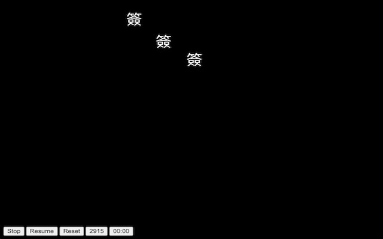

# anigamerdanmu

Read danmu from Anigamer video and display on chrome.

[Chrome Store](https://chromewebstore.google.com/detail/anigamerdanmu/nahpabdckngnlkckbfndfmokehjomfbg)

## How to use

- Install `anigamerdanmu` as chrome extension.
- Go to anigamer video, choose video and click `play danmu`.
- Play danmu on the new window.

## Control

- Stop: stop playing danmu
- Resume: resume to play danmu
- Reset: reset time to `00:00`
- Count: total danmu counts
- Time: change danmu's times by clicking time button

## Demo

## Reference

- [CommentCoreLibrary](https://github.com/jabbany/CommentCoreLibrary)

